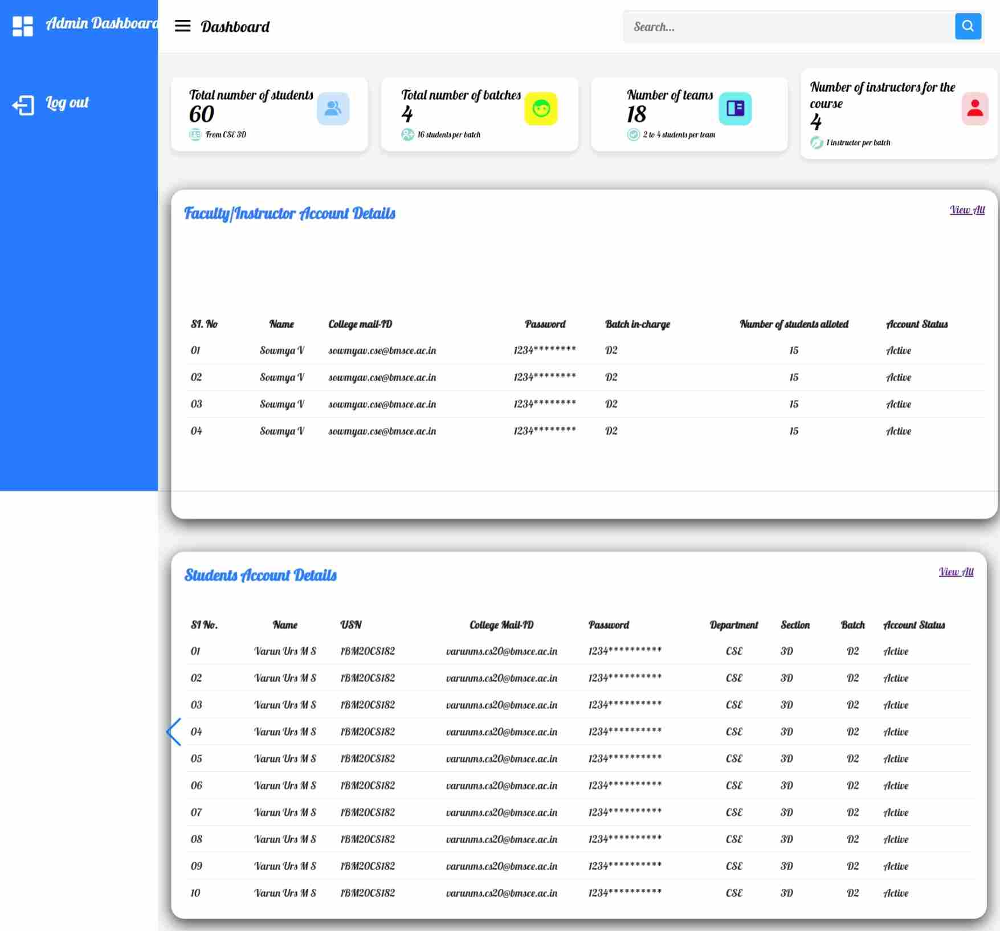
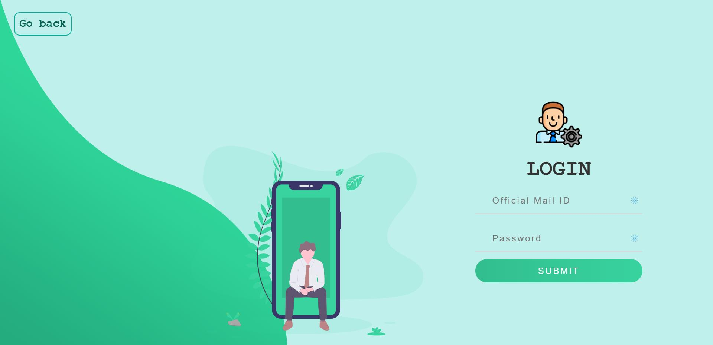
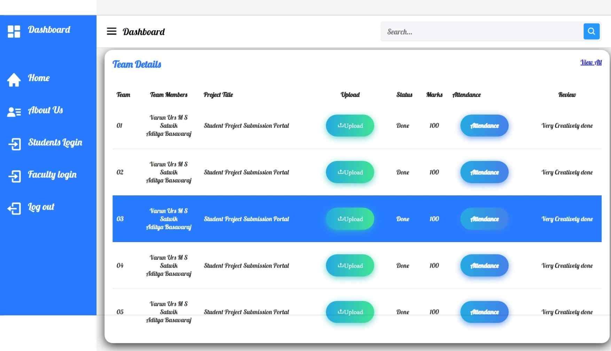

# Student-Project-Submission-Portal
## Online Student Project Submission Portal

The Online Student Project Submission Portal is a cutting-edge platform designed to streamline the project submission process for students and facilitate efficient project reviewing for faculty members. With its user-friendly interface and robust features, this platform aims to enhance student-faculty collaboration, leading to a more productive and rewarding academic experience.

### Features

- **Easy Project Submission**: The portal allows students to effortlessly submit their projects online, eliminating the need for cumbersome paperwork and manual submissions.

- **Secure and Accessible**: The platform ensures the security of project submissions while providing 24/7 access from any device with an internet connection.

- **Efficient Reviewing**: Faculty members can efficiently review submitted projects, provide feedback, and track progress through a centralized dashboard.

- **Collaborative Environment**: Students and faculty can engage in seamless collaboration, fostering meaningful discussions and improvements to project ideas.

- **Version Control**: The portal implements version control for submitted projects, enabling students to update and revise their work as necessary.

- **Real-Time Notifications**: Users receive real-time notifications for project updates, deadlines, and feedback, ensuring timely responses and actions.

- **Data Analytics**: Faculty members can gain valuable insights through data analytics, allowing them to track project trends and identify areas for improvement.

- **Documentation Support**: The platform accommodates various file formats, including documents, images, and multimedia, to ensure comprehensive project documentation.

## Admin Dashboard

## Login Page

## Admin Dashboard

## Admin Dashboard

