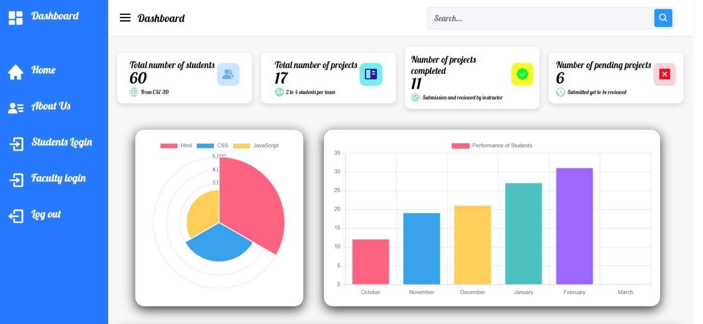

# Student-Project-Submission-Portal
## Online Student Project Submission Portal

The Online Student Project Submission Portal is a cutting-edge platform designed to streamline the project submission process for students and facilitate efficient project reviewing for faculty members. With its user-friendly interface and robust features, this platform aims to enhance student-faculty collaboration, leading to a more productive and rewarding academic experience.

 
 

### :sparkles: Features

- **Easy Project Submission**: The portal allows students to effortlessly submit their projects online, eliminating the need for cumbersome paperwork and manual submissions.

- **Secure and Accessible**: The platform ensures the security of project submissions while providing 24/7 access from any device with an internet connection.

- **Efficient Reviewing**: Faculty members can efficiently review submitted projects, provide feedback, and track progress through a centralized dashboard.

- **Collaborative Environment**: Students and faculty can engage in seamless collaboration, fostering meaningful discussions and improvements to project ideas.

- **Version Control**: The portal implements version control for submitted projects, enabling students to update and revise their work as necessary.

- **Real-Time Notifications**: Users receive real-time notifications for project updates, deadlines, and feedback, ensuring timely responses and actions.

- **Data Analytics**: Faculty members can gain valuable insights through data analytics, allowing them to track project trends and identify areas for improvement.

- **Documentation Support**: The platform accommodates various file formats, including documents, images, and multimedia, to ensure comprehensive project documentation.

 
 

### :wrench: Tools and Technology
  
  

 
 

### :framed_picture: Project Snapshots

## Admin Dashboard

## Login Page

## Faculty Dashboard

## Student Dashboard

 
 

### :loudspeaker: Feedback and Support

For any feedback, suggestions, or support, please open an issue on our GitHub repository or reach out to our team via email.

Let's drive the automotive industry into the future with the Car Sales Management System! Embrace the power of technology for an optimized and seamless car service experience.
